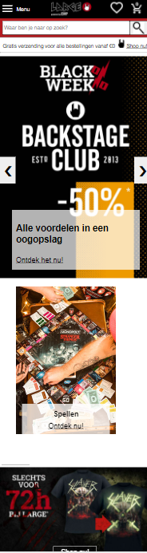
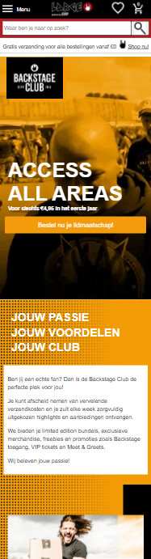
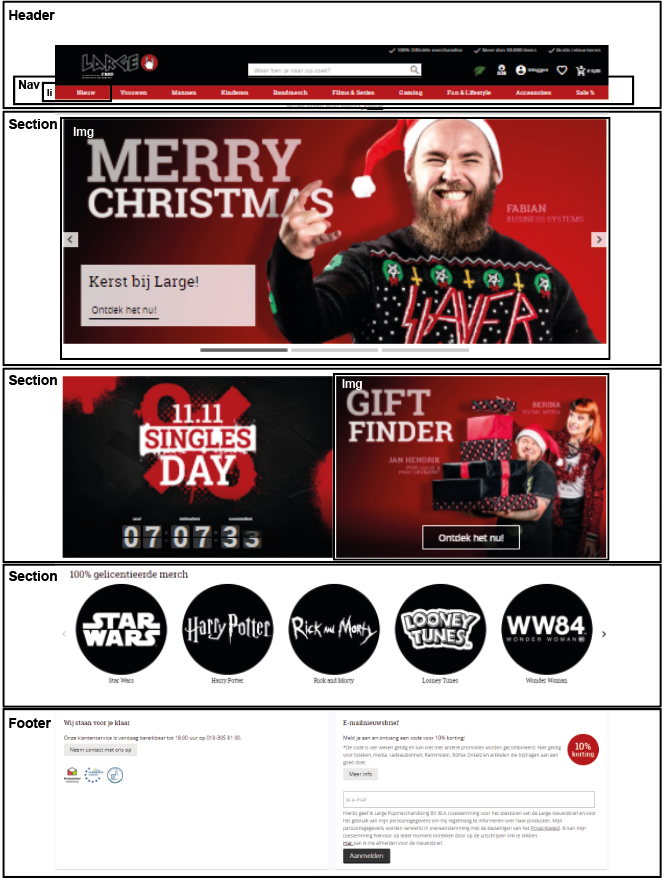
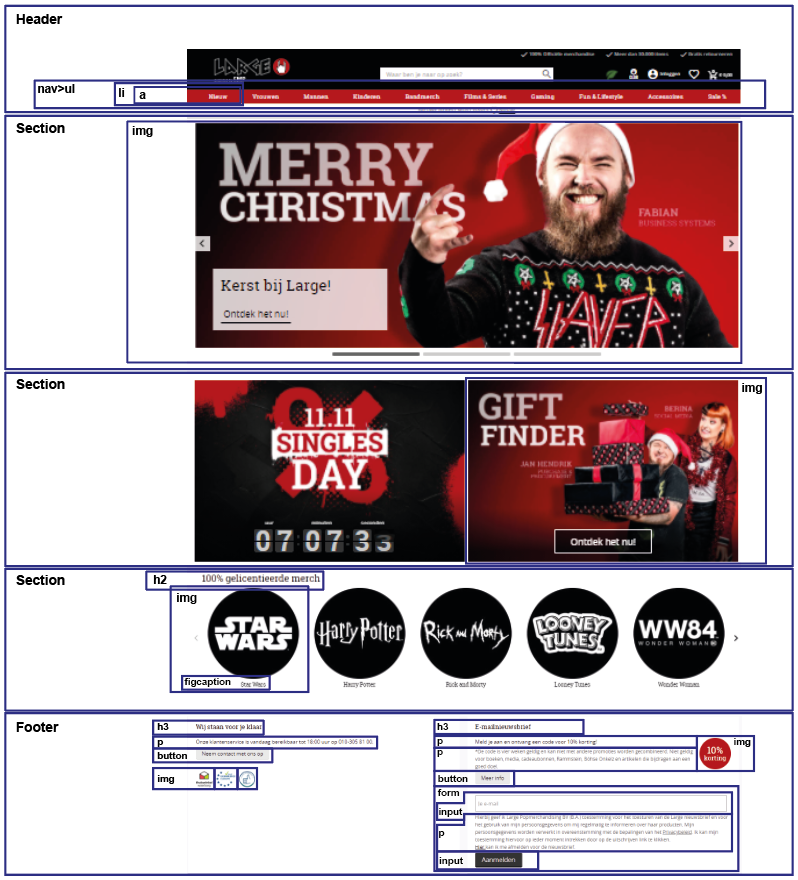
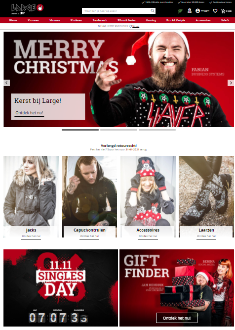
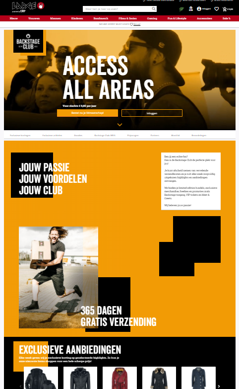

# Procesverslag

**Auteur:** Maylinn Kwakman

Markdown cheat cheet: [Hulp bij het schrijven van Markdown](https://github.com/adam-p/markdown-here/wiki/Markdown-Cheatsheet).
## Bronnenlijst

1.  <https://www.w3schools.com/>
2.  <https://stackoverflow.com/>
3.  \-...-

## Eindgesprek (week 7/8)

Het plan was om de kerstvakantie en de week na de kertvakantie te besteden aan het zoeken van een stageplek en alle vakken naast frontend afmaken, zodat ik de laatste week aan frontend kon besteden. Dit ging echter niet helemaal zoals gepland, waardoor ik uiteindelijk veel tijd tekort had. 
Ik heb in de laatste week de eerste pagina responsive gemaakt, dit ging grotendeels goed. De tweede pagina is niet gemaakt zoals de officiële op desktop formaat, omdat ik niet genoeg tijd had om dit hetzelfde af te maken. Ik heb wel een javascript slider kunnen maken op de eerste pagina. Ook de footer is niet helemaal afgewerkt qua html i.v.m. tijdtekort. 
Problemen: 
\-Iets waar ik uren aan heb besteed en nog steeds niet heb kunnen laten werken zijn de dropdowns in het hamburger menu. De eerste dropdown werkt, na classes en id's toe te voegen, maar aangezien ik vaak hoor dat je dit niet te veel moet doen leek het mij geen goed idee om dit voor nog 11 dropdowns te doen. 
\-Na meerdere pogingen kan ik nog steeds niet vinden hoe ik mijn tekst laat scalen.

Ik ben wel tevreden met hoeveel ik heb geleerd over frontend tijdens dit vak en ik ben heel blij met de dingen die wél zijn gelukt, zoals het hamburger menu, de slider en eindelijk leren hoe je iets positioneert zonder dat alles kapot gaat op het moment dat je de viewwidth verandert.

**Screenshot(s):**

## Voortgang 3 (week 6)

### Stand van zaken

Goed: 
-Ik heb het hamburger menu in de website kunnen zetten. De dropdowns in het hamburger menu werken voor nu nog niet.

Minder goed: 
-Meerdere manieren geproberd om de tekst in de website te laten scalen, maar het lukt nog steeds niet. 
-Geprobeerd de video src aan te passen op andere formaten, maar dit is niet gelukt. De meeste oplossingen zijn met javascript, die ik niet begrijp en ik heb op dit moment niet de tijd om het uit te zoeken.

| Samantha(ik)                                    | Noa                                                 | Nicole                              | Maylinn    | Stein      |
| ----------------------------------------------- | --------------------------------------------------- | ----------------------------------- | ---------- | ---------- |
| Hoe kan je slomer scrollen?                     | Hoe krijg ik mijn menu over de rest van de content? | Mag ik ook andere iconen gebruiken? | geen vraag | Geen vraag |
| scrollbar weghalen en laten werken op desktop   | ---                                                 | ---                                 | ---        | ---        |
| js pathname voor code inladen werkt niet online | ---                                                 | ---                                 | ---        | ---        |

## Voortgang 2 (week 5)

### Stand van zaken

Goed: 
-Van het voortgangsgesprek heb ik geleerd waarom ik zo veel moeite had met de video scalen. Er worden op de officiële website namelijk 2 verschillende video's gebruikt met andere formaten.

Minder goed: 
-Ik heb vooral gewerkt aan de andere vakken, dus ik heb geen tijd gehad om aan de website te werken.

| Samantha                                                    | Noa                                            | Nicole           | Maylinn                                                   | Stein      |
| ----------------------------------------------------------- | ---------------------------------------------- | ---------------- | --------------------------------------------------------- | ---------- |
| Hoe zorg ik er voor dat mijn animatie bij 10 graden begint? | Hoe maak ik een hamburger menu?                | Wat is frontend? | Ik heb een vraag over de scaling van de tekst en de video | Geen vraag |
| ---                                                         | Vraag over pijltjes bij verschillende sections | ---              | ---                                                       | ---        |

## Voortgang 1 (week 3)

### Stand van zaken

Goed: 
-Plaatjes in de pagina gezet en met css sliders maken. 
-Na assessment: Idee gekregen voor een gradient achtergrond met stipjes 
-Na assessment: Na een width op het menu te zetten werkt de position: fixed en ziet het er niet meer bugged uit.

Minder goed: 
-Elementen positioneren op een responsive manier. 
-Het menu fixed/sticky maken. 
-Video laten scalen.

### Agenda voor meeting

| Samantha                                                                           | Noa                               | Nicole                                     | Maylinn                                           | Stein                             |
| ---------------------------------------------------------------------------------- | --------------------------------- | ------------------------------------------ | ------------------------------------------------- | --------------------------------- |
| Hoe zorg ik er voor dat de achtergrondkleur verandert als een element in beeld is? | Ik heb een vraag over mijn header | Hoe krijg ik ruimte tussen mijn scrollbar? | Hoe maak je een achtergrond gradient met stipjes? | Ik heb een vraag over mijn header |
| In hoeverre is dit de surface plane/wat moet er bij?                               | ---                               | Hoe krijg ik ruimte onder mijn button?     | Hoe krijg ik mijn header fixed?                   | ---                               |
| ---                                                                                | ---                               | ---                                        | Hoe krijg ik sommige dingen responsive            | ---                               |

## Breakdownschets (week 1)

**Versie 2:**

## Intake (week 1)

**Je startniveau:** Rood

**Je focus:** Responsive

**Je opdracht:** <https://www.large.nl/>

**Screenshot(s) van de eerste pagina (desktop screen):**

**Screenshot(s) van de tweede pagina (desktop screen):**

